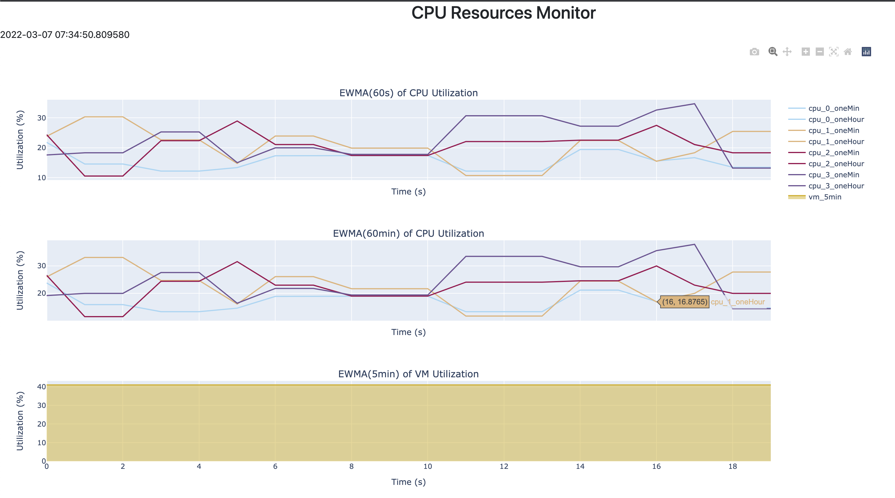

# Project3 Discussion
Ziang Zhou
## 1. file usage
```bash
bash build_docker.sh
```
## 2. Metrics discussion
Below is a screenshot of the monitor.

I learned and applied the idea of `ewma` from [video](https://www.youtube.com/watch?v=lAq96T8FkTw&t=249s&ab_channel=DeepLearningAI).  
The way I calculate the Exponentially Weighted Moving Average (EWMA) is by setting a $\beta$ in advance, such that $\beta$ satisfies $\frac {1}{1-\beta}=d$, where d spans the average range. For 1min `ewma`, $d=12$; for 1hour `ewma`, $d=720$. Therefore, $\beta_{1min}=\frac{11}{12}$, and $\beta_{1hour}=\frac{719}{720}$.   
Based on this, the only data that I store in `context.env` is the `ewma` value at the most recent datapoint. The `ewma` of `cpu_utilization` metric is calculated from the above steps. The same logic applies to the metric `VM_used_past_5min_avg`.